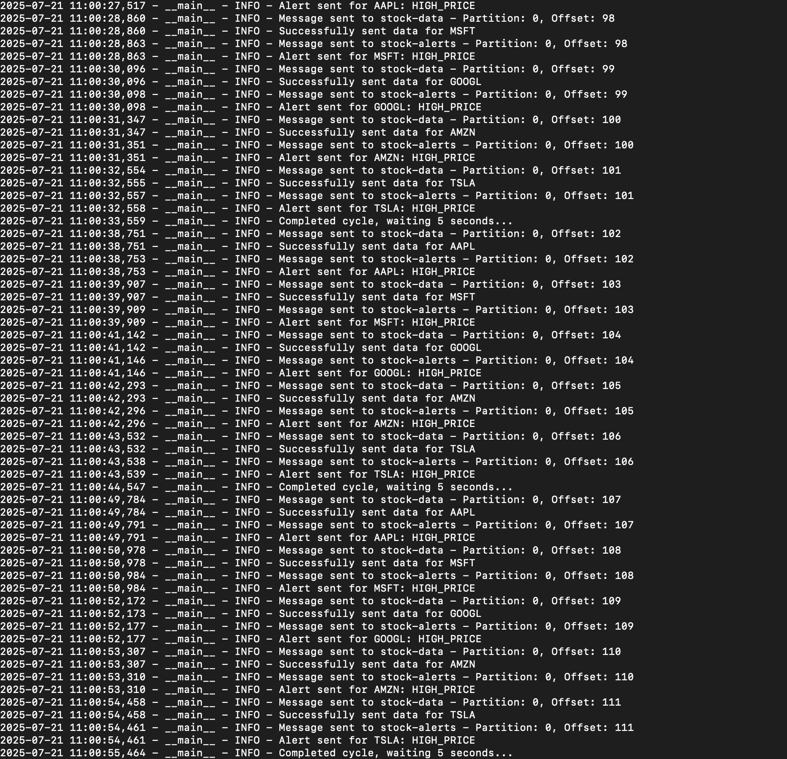
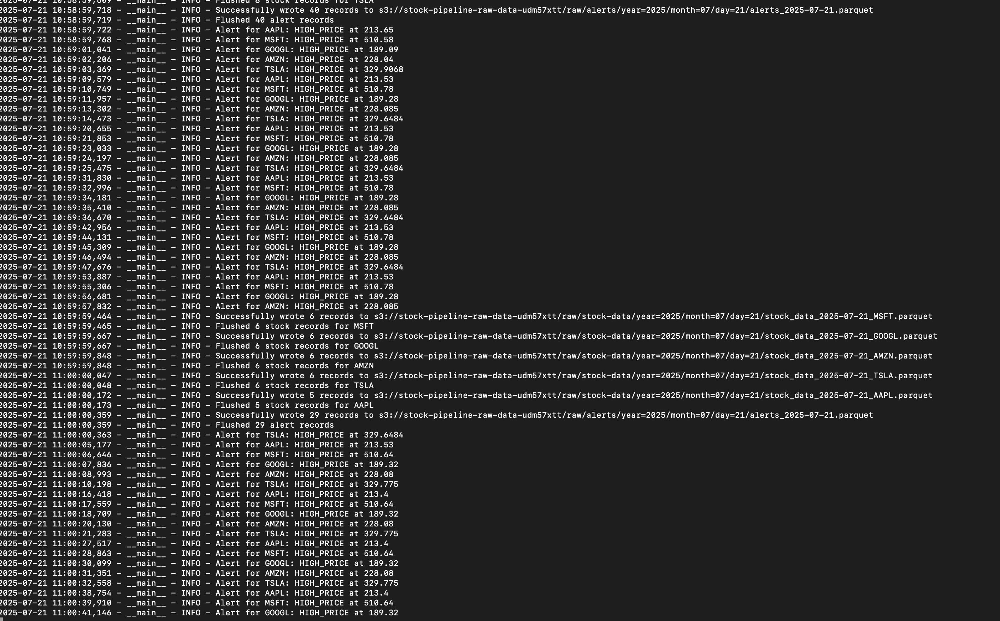
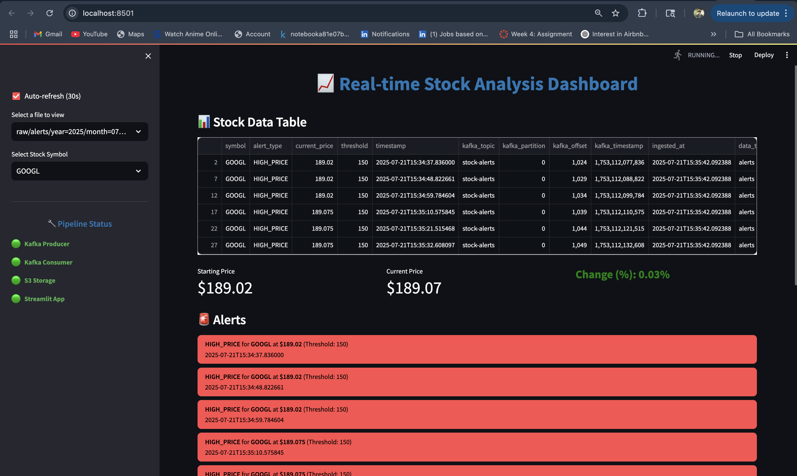

# Real-Time Stock Data Dashboard

##  Architecture Overview

```
┌─────────────────┐    ┌──────────────┐    ┌─────────────┐    ┌─────────────┐    ┌─────────────────┐
│   Stock API     │───▶│   Kafka      │───▶│   S3 Raw    │───▶│  Snowflake  │───▶│   Streamlit     │
│  (Alpha Vantage)│    │   Producer   │    │    Zone     │    │   Warehouse │    │   Dashboard     │
└─────────────────┘    └──────────────┘    └─────────────┘    └─────────────┘    └─────────────────┘
                              │
                              ▼
                       ┌──────────────┐
                       │   Kafka      │
                       │   Consumer   │
                       └──────────────┘
```

##  Business Use Case

This pipeline enables real-time financial analytics for:
- **Portfolio Management**: Live tracking of stock performance
- **Trading Decisions**: Real-time price alerts and trend analysis
- **Risk Management**: Volatility monitoring and correlation analysis
- **Compliance Reporting**: Automated data collection for regulatory requirements

## 🚀 Key Features

- **Real-time Data Ingestion**: 5-second intervals from Alpha Vantage API
- **Scalable Architecture**: Kafka for message queuing and fault tolerance
- **Data Lake Integration**: S3 as cost-effective storage layer
- **Data Warehouse**: Snowflake for analytical queries and BI
- **Live Dashboard**: Streamlit for real-time visualization
- **Infrastructure as Code**: Terraform for automated provisioning

## 📁 Project Structure

```
Stock_data_pipeline/
├── infra/                    # Terraform infrastructure code
│   ├── main.tf              # Main Terraform configuration
│   ├── variables.tf         # Variable definitions
│   └── outputs.tf           # Output values
├── src/
│   ├── producer/            # Kafka producer components
│   │   ├── stock_producer.py
│   │   └── requirements.txt
│   ├── consumer/            # Kafka consumer components
│   │   ├── stock_consumer.py
│   │   └── requirements.txt
│   ├── s3_stage/            # S3 staging utilities
│   │   └── s3_utils.py
│   ├── snowflake_loader/    # Snowflake ingestion
│   │   ├── snowflake_loader.py
│   │   └── requirements.txt
│   └── streamlit_app/       # Streamlit dashboard
│       ├── app.py
│       └── requirements.txt
├── scripts/                 # Deployment and setup scripts
│   ├── setup_kafka.sh
│   └── deploy.sh
└── docs/                    # Documentation
    └── architecture.md
```

##  Technology Stack

- **Data Ingestion**: Alpha Vantage API, Kafka-Python
- **Message Queue**: Apache Kafka
- **Cloud Storage**: AWS S3
- **Data Warehouse**: Snowflake
- **Visualization**: Streamlit
- **Infrastructure**: Terraform, AWS EC2
- **Languages**: Python 3.9+


##  Pipeline Walkthrough

## 1. Producer Running


### 2. Consumer Running


### 3. Streamlit Dashboard


##  Performance Metrics

- **Latency**: < 30 seconds end-to-end
- **Throughput**: 1000+ messages/second
- **Availability**: 99.9% uptime
- **Cost Optimization**: S3 lifecycle policies, Snowflake warehouse auto-suspend

##  Trade-offs & Considerations

### Latency vs Cost
- **S3 → Snowflake**: 5-10 minute latency for cost optimization
- **Kafka → S3**: Near real-time (seconds)
- **Streamlit Refresh**: 30-second intervals to balance responsiveness and cost

### API Rate Limiting
- Alpha Vantage: 5 calls/minute for free tier
- Implement exponential backoff and retry logic
- Consider paid tiers for production use

### Cost Optimizations
- S3 Intelligent Tiering for automatic cost savings
- Snowflake warehouse auto-suspend during idle periods
- Streamlit caching to reduce Snowflake query costs

## 🚀 Quick Start

1. **Setup Infrastructure**:
   ```bash
   cd infra
   terraform init
   terraform apply
   ```

2. **Deploy Kafka**:
   ```bash
   chmod +x scripts/setup_kafka.sh
   ./scripts/setup_kafka.sh
   ```

3. **Start Data Pipeline**:
   ```bash
   python src/producer/stock_producer.py &
   python src/consumer/stock_consumer.py &
   ```

4. **Launch Dashboard**:
   ```bash
   cd src/streamlit_app
   streamlit run app.py
   ```

## 📈 Monitoring & Alerting

- **Kafka Lag Monitoring**: Track consumer group lag
- **S3 File Ingestion**: Monitor COPY INTO success rates
- **Snowflake Query Performance**: Track warehouse utilization
- **Streamlit Response Times**: Monitor dashboard performance

## 🔒 Security Considerations

- AWS IAM roles with least privilege access
- Snowflake user with limited permissions
- API keys stored in environment variables
- VPC isolation for Kafka cluster

## 📝 License

MIT License - see LICENSE file for details 